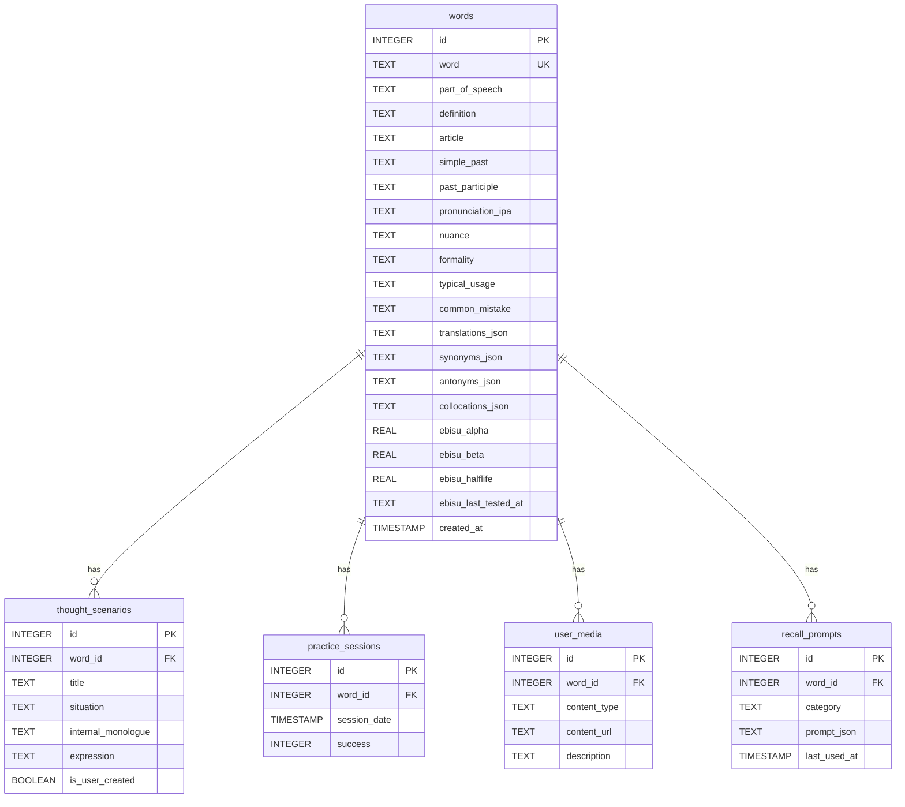

# Flash Denken 🧠🇳🇱

A Dutch vocabulary learning app that uses AI and spaced repetition to move beyond rote memorization toward genuine fluency.

> **Stack:** Python · Streamlit · Google Gemini · Ebisu · SQLite

---

## Features

| Feature | Description |
|---|---|
| **AI Word Analysis** | Deep linguistic profiles: nuance, formality, collocations, etymology |
| **Thought Scenarios** | Learn words through Situation → Inner Monologue → Expression, not translation |
| **Active Recall** | Context-driven prompts (Slice of Life, Problem-Solution, Sensory-Emotional) |
| **Spaced Repetition** | Ebisu (Bayesian) algorithm schedules reviews at the optimal moment |
| **Multimedia Anchors** | Attach personal images/videos to words for stronger memory hooks |

---

## Quick Start

### Prerequisites
- Python 3.9+
- A [Google Gemini API key](https://aistudio.google.com/app/apikey)

### Setup

```bash
# 1. Clone
git clone <repository-url>
cd flash_denken

# 2. Install dependencies
pip install -r requirements.txt

# 3. Set your API key
export GEMINI_API_KEY="your-key-here"

# 4. Create the database (run once)
mkdir -p data
python create_db.py

# 5. Launch
streamlit run app.py
```

---

## Project Structure

```
flash_denken/
├── app.py                  # Streamlit entry point
├── create_db.py            # One-time DB initialisation
├── requirements.txt
└── src/flash_denken/
    ├── parameters.py       # Central config (API keys, paths, algorithm settings)
    ├── state_manager.py    # Streamlit session state initialisation
    ├── output_models.py    # Pydantic schemas for all AI responses
    ├── instructions.py     # LLM system prompts
    ├── gemini.py           # Gemini API client
    ├── db_operations.py    # SQLite CRUD layer
    ├── ebisu_tools.py      # Spaced-repetition logic
    ├── html_generation.py  # Styled HTML/CSS cards
    ├── utils.py            # Shared helpers (parsers, validators)
    └── tabs/
        ├── learning/       # "Learning" tab widgets
        └── recall/         # "Recall" tab widgets
```

---

## Database Schema



---

## Design Principles

**Thought Scenarios over translation** — mapping the pre-linguistic thought directly to the Dutch word trains the same mental pathway a native speaker uses.

**Structured AI output** — all Gemini responses are parsed into strict Pydantic models, eliminating unparseable free-text and guaranteeing data integrity.

**Probabilistic scheduling** — Ebisu models memory as a Bayesian half-life, so reviews are scheduled exactly when recall probability drops to an acceptable threshold.

**Separation of concerns** — SQL logic lives in `db_operations.py`, AI logic in `gemini.py`, and UI in `tabs/`, keeping each layer independently testable.

---

## License

See [LICENSE](LICENSE).
